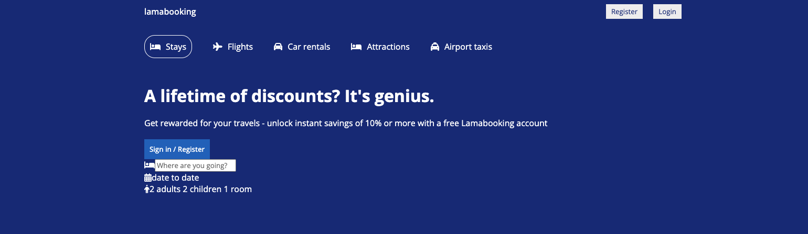
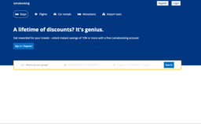
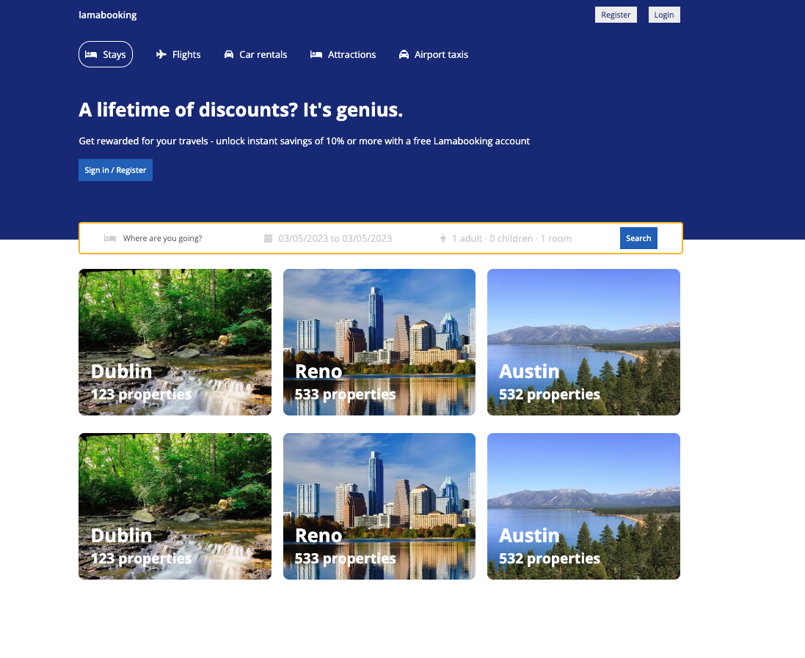
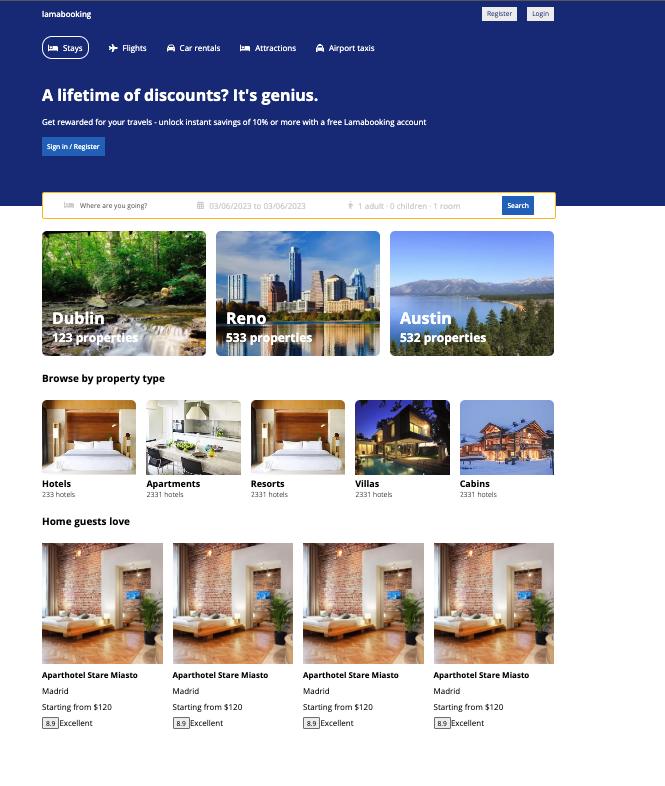
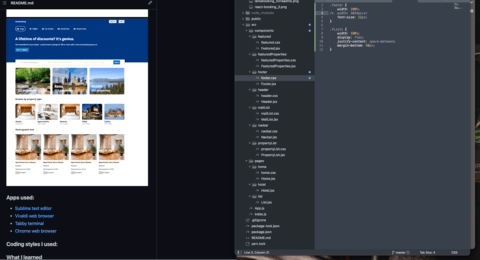

# React Booking | Reservation App UI Design for Beginners
Tutorial URL: https://www.youtube.com/watch?v=RkWpJ4XUHuw
Tutorial description: React booking system design tutorial. React hotel reservation app UI design using HTML, CSS, and React Calendar.

___________

### Software versions
	Fontawesome-svg-core - 6.3.1
	React 18
	React Router Dom - 6.8.2
### Problems in the project:
1.
2.

### How to use
1. Type what city and state your going to in the 'Where are you going?' input box
2. Pick what date range by clicking the date input and close the date input dialog by clicking the date input again.
3. Change what persons to reserve by clicking the '1 adult - 0 children' input.

### Photos of project:





### Apps used:
- [Sublime text editor](https://www.sublimetext.com)
- [Vivaldi web browser](https://vivaldi.com)
- [Tabby terminal](tabby.sh)
- [Chrome web browser](https://www.google.com/chrome/)

### Coding styles I used:

### What I learned
1. I learned about 'react-date-range' and how they have a DateRange component for selecting a range of dates. Similar functionality to the one Airbnb has. 
2. How using two width properties in CSS is right.
	At first knowledge I knew you only need one width property per selector but CSS is dynamic & flexible and using two widths with different percentages can help achieve targeted results.
	
	Notice how the content in the footer section without the width set to 1024px is overflowing beyond the viewpoint but with another width property set to 1024px value it's aligned perfectly.
3. React-router-dom useNavigate hook
	It's a hook where you can redirect to a page and pass state or formData to, retrieve the form method 'POST', 'PUT', 'DELETE'. 
	``` 
		import { useNavigate } from 'react-router-dom';
		const navigate = useNavigate();
	```